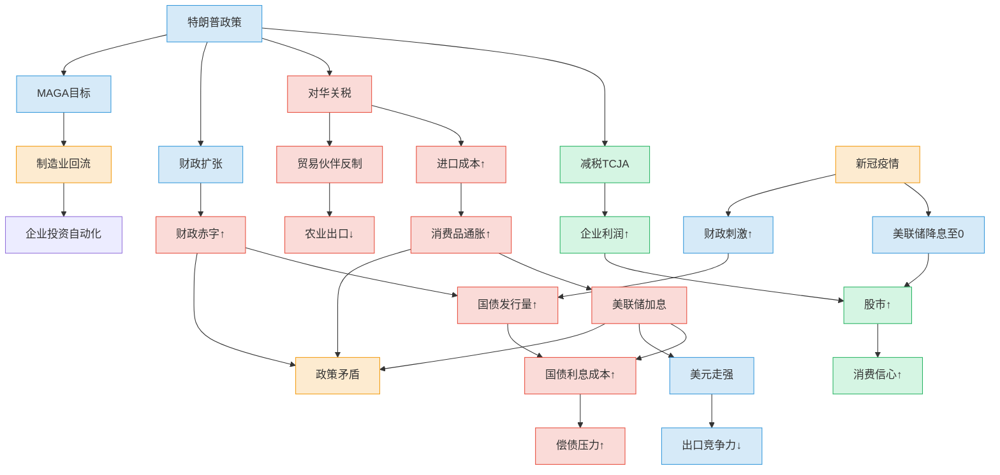

# 政治
## MAGA
maga群体 白人、中老年、教育程度较低、农村或小城镇地区。
白人蓝领工人，底层白人、中产。
反建制派选民
极右翼

## 深层政府
由一些官僚、军事、情报、金融等领域的精英组成的非正式权利网络。该群体掌握关键职位和资源，实际操控国家政策。
比如军工复合体推动军事干预，或金融集团维护宽松监管

## 觉醒文化（Woke Culture）
是对系统性不平等、歧视和权力结构的批判性反思，强调对边缘群体的权益保护。
就是政治正确、lgbtq+群体，女权、动保等。

## 民主党&共和党

| 维度       | 共和党（GOP）                     | 民主党（Democrats）             |
|------------|----------------------------------|--------------------------------|
| 核心理念   | 传统资本主义秩序                 | 进步主义治理架构               |
| 经济主张   | 自由市场至上（减税、去监管）     | 政府干预经济（福利、环保投资） |
| 社会文化   | 保守传统（宗教、反"觉醒文化"）   | 多元进步（LGBTQ+、种族平等）   |
| 国家机器   | 强权政府（军警、边境管控）       | 制度性公平（司法改革、移民包容） |
| 外交政策   | 单边主义（美国优先、强硬对抗）   | 全球主义（多边合作、气候协议） |
| 代表群体   | 石油军工集团、福音派、小企业主   | 科技金融资本、工会、城市精英   |
| 选民基础   | 白人蓝领、乡村、南方保守派       | 少数族裔、年轻群体、沿海都市   |
| 深层逻辑   | 维护能源-军工霸权体系            | 构建数字-金融新霸权            |

共和党 = 传统能源/军工资本的利益捍卫者

民主党 = 新兴科技/金融资本的规则制定者
通过“左右轮替”维持系统稳定，但共同服务于资本扩张的核心逻辑 

## maga政策
从经济上来说：
外来移民会抢夺底层白人的工作，所以maga反对外来移民。
因为全球化，外国工人会争夺美国的工作，所以maga反外国工人，反对全球化，所以与全球化的资本对立。
因为底层白人受教育程度不高，所以比较保守传统，反对lagtq+，反对觉醒文化等。
因为来自传统工业区的白人蓝领工人，涉及传统能源、制造业，而新能源会导致他们失业，所以反对新能源，反对环保。

所有的政策来源，都来自于有价值的选票群体的，自身的经济和阶级诉求。

# 经济

## 美联储的目标
    最大化就业：通过调节货币政策促进充分就业，降低失业率。
    稳定物价：控制通货膨胀（通常以2%年通胀率为目标），避免物价剧烈波动。

## 特朗普政策

目标：减少贸易逆差、保护美国产业（解决就业）

增加关税-》进口减少-》进口商品价格增加-》通货膨胀-》美联储加息-》国债收益率提高 -》政府成本提高财政赤字恶化

